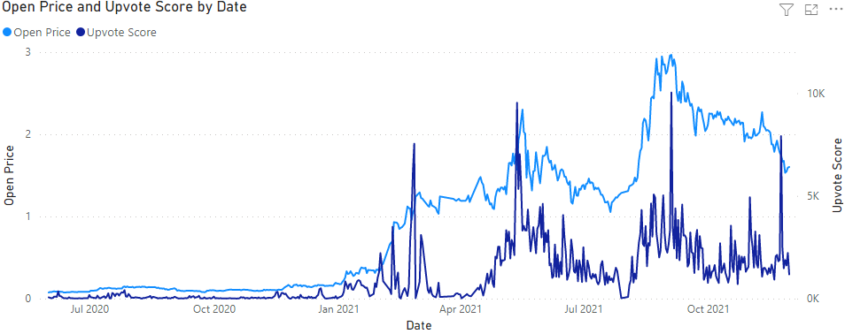
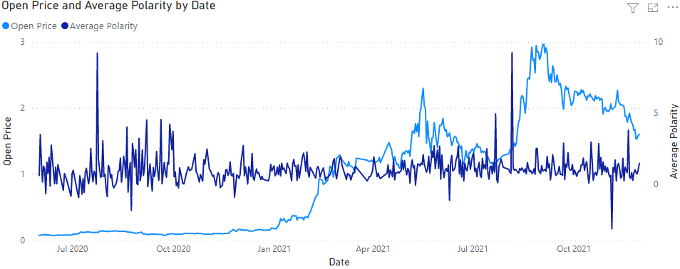
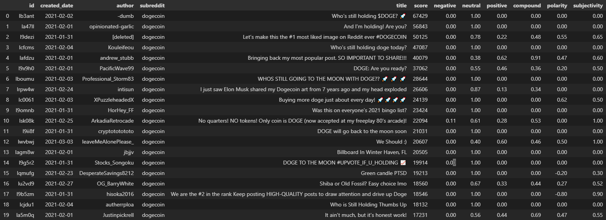
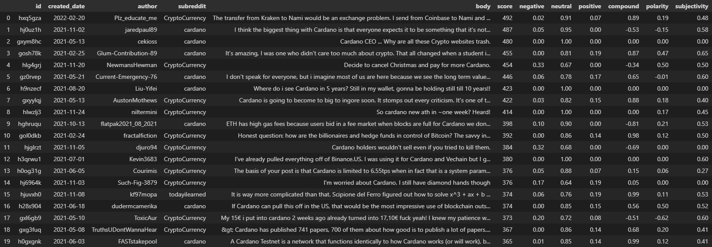

# reddit-crypto-model

> **DISCLAIMER:**  Personally, I am very risk-averse, and do not day-trade or invest in cryptocurrencies.  (No disrespect to those that do.)  I don't actually expect this algorithm to be profitable.  It is just for fun.

This project attempts to use sentiment analysis on Reddit comments to predict cryptocurrency (and memestock) prices.  Perhaps a foolhardy endeavor, but the idea arguably has some merit, because crypto prices are highly speculative and psychologically-driven.  Reddit is one of the highest traffic websites in the USA, and it has several active cryptocurrency communities.  The hope is that measuring the "Reddit hivemind" will glean some insight into the momentum of prices.

In short, this project uses the [Pushshift API](https://github.com/pushshift/api) to gather all Reddit comments (worldwide across 2020-2021) mentioning a cryptocurrency [ticker symbol](https://coinmarketcap.com/alexandria/glossary/ticker-symbol), passes those comments through a sentiment analysis engine, and uses the data to train a time series model for each ticker symbol.

To reduce complexity, we commit to one big simplification up front:  This is a daily model.  Assume ETL will run at midnight, and trades are executed once-per-day, all at once in the morning.  [Backtesting](https://www.investopedia.com/terms/b/backtesting.asp) will reflect this cadence.

If you want to learn more about the project, see the relevant sections below:


## Contents

- [Infrastructure](#infrastructure)
- [ETL](#etl)
    - [Extractors](#extractors)
    - [Transformers](#transformers)
    - [Caching](#caching)
- [Modeling](#modeling)
    - [Data Analysis](#data-analysis)
    - Feature Engineering
    - Feature Selection
    - Model Selection


## Infrastructure

Since this is a side project with tight financial margins, my top priority when choosing infrastructure was cost, i.e. I want it to be free.  So, while I typically prefer using EC2 for compute and S3 for storage, this time I opted for a beat-up laptop and 1TB external hard drive, respectively.  That being said, the code is written with some [storage abstractions](rcm/core/cache.py), so if we ever wanted to scale up into the cloud, this is theoretically possible with minimal code changes.


## ETL

Before any modeling can begin, we must first prepare the feature and label data.

For this project, the ETL code is organized into [extractors](rcm/extractors) and [transformers](rcm/transformers).  Extractors pull data from (slow) remote sources, e.g. Yahoo Finance and Pushshift APIs, and cache the results locally.  Transformers take that extracted data and transform it via sentiment analysis, aggregation, smoothing, etc, before passing it into the model.  The scope of the ETL workload is controlled via [app](rcm/core/config.yaml) and [symbol](rcm/core/symbols.yaml) configuration files.  This workload is initiated via the [main method](main.py).


### Extractors

- [YahooFinanceExtractor](rcm/extractors/yahoo.py):  Extracts price history for each ticker symbol via [Yahoo Finance API](https://github.com/ranaroussi/yfinance).
- [RedditExtractor](rcm/extractors/reddit.py):  Extracts Reddit comments via [Pushshift API](https://github.com/pushshift/api).


### Transformers

- [SentimentTransformer](rcm/transformers/sentiment.py):  Takes the Reddit comments extracted previously, and passes them through two sentiment analysis libraries:  [VaderSentiment](https://github.com/cjhutto/vaderSentiment) and [TextBlob](https://github.com/sloria/TextBlob).
- [AggregationTransformer](rcm/transformers/aggregation.py):  Aggregates Reddit comment scores and sentiment values up to (date, symbol) level.
- SmoothingTransformer:  Not yet implemented.  Calculates moving averages for various time series features.


### Caching

This codebase uses a very defensive caching strategy.  The majority of Reddit data is pulled via Pushshift API, which is throttled to return (at most) [100 comments per second](https://www.reddit.com/r/pushshift/comments/ih66b8/difference_between_size_and_limit_and_are_they/).  Thus, it's not sufficient to keep the data in-memory.  It needs to get persisted somewhere, otherwise a crash could result in hours (or even days) of lost API responses.

For example, suppose our training data contains 50 million Reddit comments.  This will take (50 million comments) * (1 second / 100 comments) ~= 6 days to pull via Pushshift.  If our code crashes 5 days in, then we are absolutely screwed unless we persisted the data somewhere.

The RedditExtractor code works like this:  Suppose we want to load all comments containing the word `ethereum`.  Then our RedditExtractor will iteratively query Pushshift, and gradually pull all comments across a 24-hour period (via consecutive 100-comment batches).  When finished, we take the union of those API responses, and cache them to disk as a zipped JSON file.  Then, we start pulling the *next* 24-hour period, and then we cache that, etc.

This results in a local cache directory like this:

```text
.
└── reddit_comments
    └── word=ethereum
        └── year=2020
            └── month=01
                ├── day=01
                │   └── 0.json.gz
                ├── day=02
                │   └── 0.json.gz
                └── day=03
                    └── 0.json.gz
```

> **NOTE:**  I intentionally used [Hive-style partitioning](https://athena.guide/articles/hive-style-partitioning) above, in case we ever want to query the data via a distributed engine like Apache Spark or Amazon Athena.

So, if our code crashes 5 days in, we are no longer screwed.  All of the data is replicated locally, thus it can be read into memory relatively quickly.

It's important to note:  this defensive caching strategy isn't *only* about recovering from crashes.  It's also about maintaining an evolving, time-series database.  For example, suppose we want to re-train the model every morning (to keep up with evolving sentiments on Reddit).  In this context, it would be wasteful to pull the comment history *from scratch* every time.  Instead, it is much more sensible to reuse the API responses from previous daily runs.  Caching makes all of this possible.  It also speeds up development and testing significantly, e.g. hitting an debugger breakpoint located *after* the extractor step no longer takes 6 days.


## Modeling

### Data Analysis

Before delving into any feature engineering work, I wanted to simply visualize the data and get a feel for it.



- Light blue line:  The price of a cryptocurrency named Cardano.
- Dark blue line:  The sum of upvote scores, taken across all comments posted on Reddit between 2020-2021 containing the word 'cardano'.

My initial reaction is:  holy crap there is definitely a correlation!  However, a more sobering realization is:  this correlation might be reactionary rather than predictive.  For example, if people are only talking about Cardano *after* the price goes up, then this data won't help us.  To get an edge, we need the Reddit signals to spike *before* the price does, not after.  For example, the dark blue spike in May 2021 is very encouraging, because it is immediately echoed by a (light blue) price spike.  Conversely, the dark blue spike in Sep 2021 is problematic, because it's followed by a price *drop*.

However, the Reddit signal doesn't *always* need to be right.  It just needs to be right more often than it's wrong.  Additionally, sentiment analysis may improve the predictive power.  For example, if the Sep 2021 spike actually represents a cluster of highly-upvoted-but-*pessimistic* comments, then the subsequent price drop might be predictable.  I tried to investigate this, but unfortunately the aggregate sentiment values are very noisy.



- Dark blue line:  The score-weighted average of all Reddit comments' _polarity_, which is a number between [-1, 1] representing the overall negative or positive emotion of a given comment.

I am not seeing any correlation yet, but I'm hoping some hidden information can be tapped into via feature engineering techniques such a moving average smoothing, exclusion of "confusing" comments, etc.

One particular problem is that VaderSentiment and TextBlob are not accustomed to Reddit vernacular.  For example, the table below shows the top [/r/Dogecoin](https://www.reddit.com/r/dogecoin) submissions posted between 2020 and 2021.



- score is the total Reddit upvote count (minus the downvote count).
- negative, neutral, positive, compound are calculated by VaderSentiment.
- polarity and subjectivity are calculated by TextBlob.

I am amused that VaderSentiment and TextBlob do not understand the phrase "to the moon", nor do they appreciate the rocket emoji.  But really, this is a big problem.  Virtually all of these posts are positive, yet only half of them get classified as such.  The calmer, less-gregarious comments perform somewhat better, but it's still a wash overall.



Above, rows 3 and 7 are spot-on, whereas rows 11 and 17 are completely misunderstood.  While Vader and TextBlob can measure the emotion of a sentence, they cannot parse that sentence and understand how the emotion relates to the ticker symbol in question, e.g. "I'd rather die than sell Cardano" sounds negative, but it's actually a huge positive for Cardano.  This is a tricky problem to solve, and seemingly outside the scope of most sentiment analysis tools.  I am hoping that with a large enough sample size, the aggregate sentiment will be meaningful.
